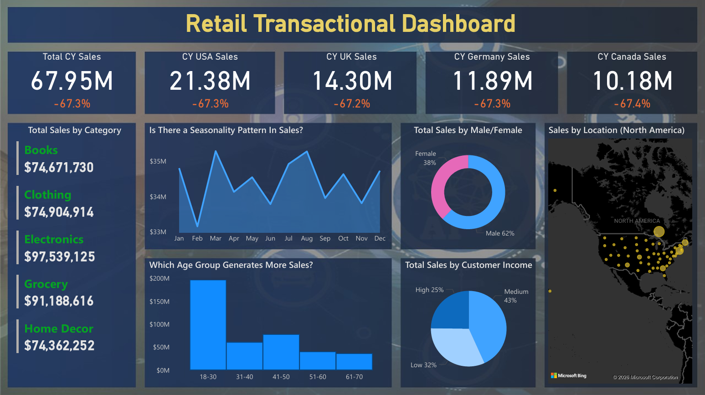

# 📊 Retail Sales Analytics Dashboard – Power BI

---

## 🚀 Project Overview
This project delivers a business-focused retail sales analysis using Power BI.  
The objective was to transform raw transactional data into a clean analytical model that enables strategic decision-making across time, geography, and customer segments.

The dashboard provides clear visibility into revenue trends, customer behavior, and product performance.

## 🖼 Dashboard Preview

---

## 🧹 Data Preparation & Transformation
- Cleaned and standardized location fields (City, State, Country, ZIP).
- Reconstructed missing dates using Year and Month logic.
- Recalculated missing sales values using Quantity × Unit Price.
- Structured the model using a star schema approach.
- Optimized the model by removing unnecessary fields and staging queries.

The goal was to ensure data consistency, accuracy, and analytical reliability.

---

## 📐 Data Modeling & Analytics
- Built a structured data model (Fact + Dimension tables).
- Created key DAX measures for:
  - Total Sales
  - Year-over-Year Growth
  - Category Contribution %
  - Seasonal Trends
- Implemented interactive filtering, drill-through, and dynamic KPIs.

---

## 📈 Business Impact
This dashboard enables stakeholders to:

- Identify top-performing countries and regions.
- Monitor sales growth trends over time.
- Detect seasonal demand fluctuations.
- Analyze customer segments by age, gender, and income level.
- Evaluate category-level revenue contribution.
- Support data-driven strategic decisions.

The solution transforms raw sales data into actionable business insights.

---

## 🛠 Tools & Technologies
- Power BI Desktop
- Power Query (M)
- DAX
- GitHub

---

## 🔗 Dataset Source
The full dataset used in this project is available on Kaggle:

👉 **[Access Dataset Here](https://www.kaggle.com/datasets/berkayalan/retail-sales-data)**

---

## ⚠ Disclaimer
This dataset was sourced from Kaggle for educational and portfolio purposes.  
The data may be synthetic and may not fully represent real-world retail operations.  
This project focuses on demonstrating data cleaning, modeling, and analytical capabilities.
